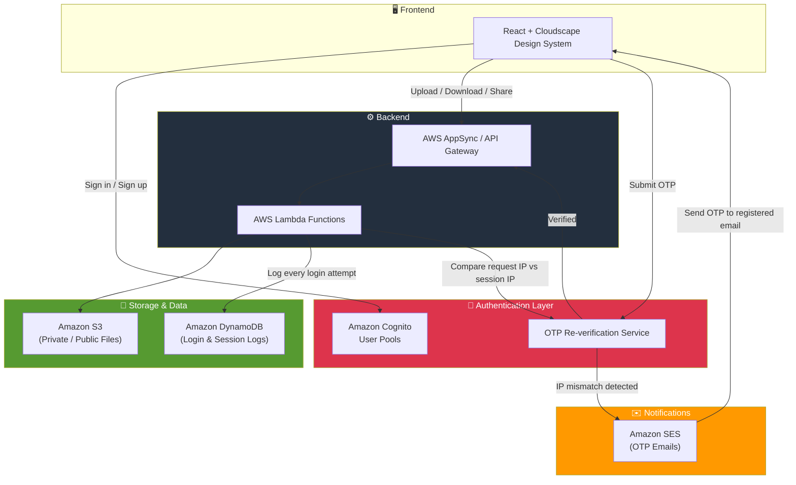

<div align="center">

# 📁 Online Document Amplify & Storage System

**A secure, cloud-native document storage platform with smart session security.**

Store, organize, and share your files privately or publicly — backed by AWS, protected by adaptive OTP verification, and fully auditable through login activity tracking.


</div>

---

## 📖 Overview

**Online Document Amplify & Storage System** is a web-based document management solution that lets authenticated users upload, organize, back up, and share files — documents, photos, videos, and more — from anywhere.

Built on top of **AWS Amplify**, it combines a serverless backend (Cognito, S3, AppSync/Lambda) with a clean **Cloudscape**-based React frontend, and extends the base architecture with **two custom security layers**:

- 🔐 **IP-switch detection with mandatory OTP re-verification**
- 🕒 **Full login activity & session logging**

These additions turn a standard "upload and store" app into something closer to a security-conscious document vault, suitable for handling sensitive personal or business files.

---

## ✨ Key Features

| Feature | Description |
|---|---|
| 🔑 **Secure Authentication** | User sign-up/sign-in powered by AWS Cognito, with verified email as the identity anchor. |
| 📤 **Upload & Manage Files** | Upload documents, photos, and videos; organize into folders. |
| 🌍 **Private / Public Sharing** | Choose whether a file is kept private or shared publicly, backed by Amazon S3 bucket policies. |
| 🛰️ **IP-Switch OTP Re-verification** | If a logged-in user's request suddenly comes from a different IP address than the one recorded at login, the session is flagged and the user must re-verify by entering an OTP sent to their registered email before continuing. |
| 🕵️ **Login & Session Logging** | Every login attempt — successful or not — is logged with timestamp, IP address, and session details, giving users (and admins) a full activity trail. |
| ☁️ **Cloud-Native & Serverless** | No servers to manage — Amplify provisions and wires up Cognito, S3, AppSync/API Gateway, and Lambda for you. |
| 🎨 **Cloudscape UI** | Frontend built with AWS's open-source Cloudscape Design System for a clean, consistent, "AWS console-like" feel. |

---

## 🔐 Security Deep Dive: IP-Switch OTP Re-verification & Login Logging

This is the core enhancement added on top of the base document-manager architecture.

**How IP-switch detection works:**
1. On successful login, the user's originating IP address is captured and stored against their active session.
2. On subsequent requests, the current request IP is compared against the stored session IP.
3. If a mismatch is detected (e.g. the user's network changed, a new device is being used, or a session token is being reused from a different location), the session is immediately treated as unverified.
4. A one-time password (OTP) is generated and emailed to the user's **registered email address**.
5. The user must enter the correct OTP to re-authorize the session before any further document actions (view, upload, download, share) are allowed.
6. This effectively neutralizes stolen or replayed session tokens, since an attacker on a different network cannot pass the OTP challenge without access to the victim's inbox.

**How login/session logging works:**
- Every login attempt is recorded — including timestamp, IP address, and outcome (success, failure, OTP re-verification triggered).
- Logs are stored so users/admins can review recent account activity and spot suspicious access patterns.
- This creates an auditable trail that pairs naturally with the OTP mechanism above — you don't just block suspicious access, you can also see exactly when and from where it happened.

---

## 🏗️ Architecture



---

## 🧰 Tech Stack

**Frontend**
- React
- AWS Cloudscape Design System

**Backend / Cloud**
- AWS Amplify (project scaffolding, CI/CD, hosting)
- AWS AppSync / API Gateway
- AWS Lambda (business logic — including IP comparison & OTP generation)

**Auth & Security**
- Amazon Cognito (user pools, authentication)
- Custom OTP re-verification logic (email-based, triggered on IP change)

**Storage & Data**
- Amazon S3 (file storage — private & public)
- Amazon DynamoDB (login activity / session logs)

**Notifications**
- Amazon SES (sending OTP emails to registered addresses)

**Hosting**
- AWS Amplify Hosting

---

## 🚀 Getting Started

### Prerequisites
- Node.js and npm installed
- An AWS account
- AWS Amplify CLI installed and configured

### Installation

```bash
# 1. Clone the repository
git clone https://github.com/Pushkar-kumarr/Online-Document-Amplify-and-Storage-System.git
cd Online-Document-Amplify-and-Storage-System

# 2. Install dependencies
npm install

# 3. Initialize Amplify in the project
amplify init

# 4. Push backend resources to AWS (Cognito, S3, API, Lambda, DynamoDB, SES)
amplify push

# 5. Run locally
npm start
```

### Deploying

```bash
# Deploy the frontend to Amplify Hosting
amplify publish
```

> 💡 Use `amplify status` at any point to see which resources are provisioned, and `amplify help` to see the full command reference.

---

## 📂 Project Structure

```
Online-Document-Amplify-and-Storage-System/
├── online-document-manager-amplify-main/   # Core application source
│   ├── src/                                # React frontend source
│   ├── amplify/                            # Amplify backend config (auth, storage, api, functions)
│   └── ...
├── .gitignore
└── README.md
```

---

## 🗺️ Roadmap

- [ ] Admin dashboard for reviewing login/session logs
- [ ] Configurable OTP expiry & retry limits
- [ ] Device fingerprinting alongside IP tracking
- [ ] Email/SMS toggle for OTP delivery
- [ ] File versioning support

---

## 🤝 Contributing

Contributions, issues, and feature requests are welcome. Feel free to open an issue or submit a pull request.

## 📄 License

This project is licensed under the MIT License.

---

<div align="center">
Built with ❤️ using AWS Amplify , Your Feedback are always Welcome ..
                        ~ ~ Pushkar 
</div>
